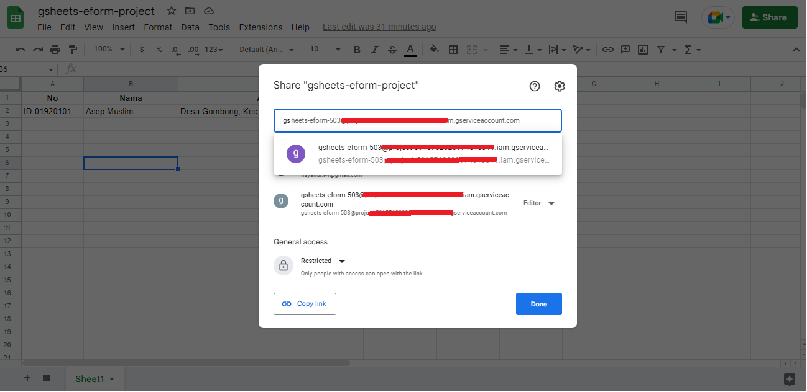
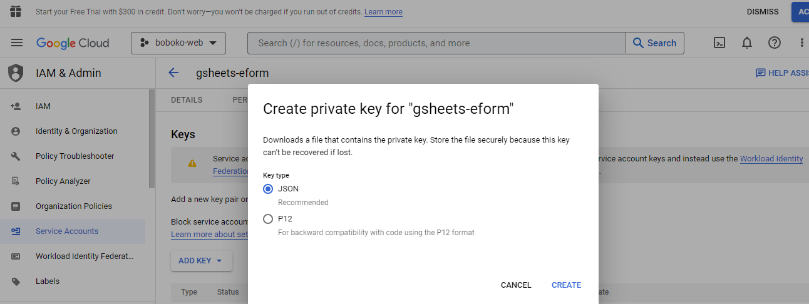

### How to setup the google sheet as a database
1. Create a new file spreadsheet.
2. Create *service account* in GCP to access the spreadsheet via API.
3. Adding or share the file spreadsheet to a service account in previously you create in GCP. 

### How to create service account in GCP
1. Compelete documentation to create service account you can follow on this documentation official GCP.  
https://cloud.google.com/iam/docs/creating-managing-service-account-keys  

### How to add or share spreadsheet to service account GCP
1. Click button share in spreadsheet.
2. Typing the name of service account and add to share access spreadsheet.

    

### How to generate google key in GCP  
1. Open your GCP console.
2. Select menu *IAM & Admin* > *Service Accounts* > Choose your service account to generate > Select tab Keys > and then *ADD KEY* > Select key type JSON.

    
